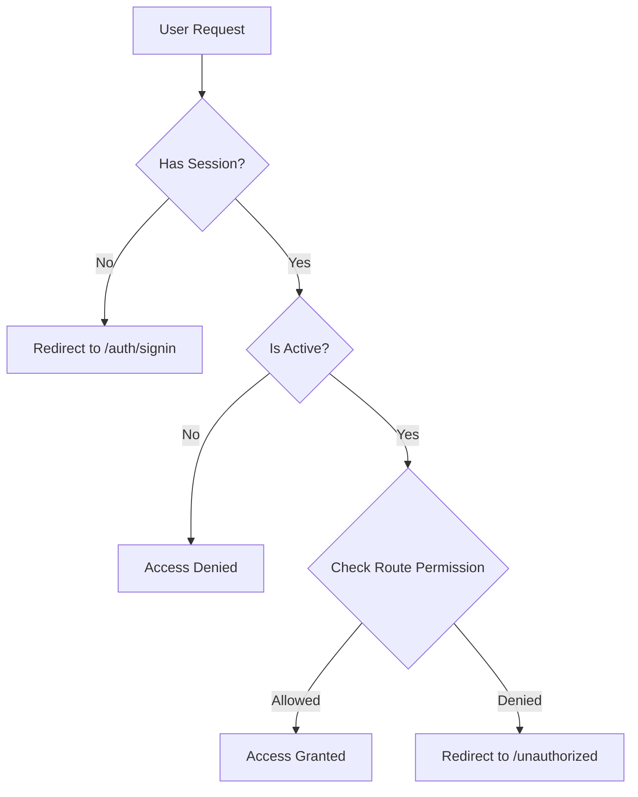

# Authorization and Roles - Complete Context

## Table of Contents
1. [User Roles](#user-roles)
2. [Authentication Methods](#authentication-methods)
3. [Authorization Architecture](#authorization-architecture)
4. [Route-Level Protection](#route-level-protection)
5. [API-Level Protection](#api-level-protection)
6. [Permission Matrix](#permission-matrix)
7. [Implementation Details](#implementation-details)

---

## User Roles

### Role Hierarchy
```
OWNER (Organization Owner)
    ↓
ADMIN (System Administrator)
    ↓
HOD (Head of Department)
    ↓
LAB_ASSISTANT (Lab Staff)
    ↓
STUDENT (Basic User)
```

### Role Definitions

#### 1. **STUDENT**
- **Access Level**: Basic
- **Authentication**: Microsoft Entra ID (Azure AD) OAuth
- **Key Permissions**:
  - Request components
  - View own requests
  - View own projects
  - Self-onboard with PRN
  - Update own profile
- **Cannot Access**:
  - Inventory management
  - User management
  - Approvals
  - Reports
  - Scanner
  - Issue components

#### 2. **LAB_ASSISTANT**
- **Access Level**: Staff
- **Authentication**: Credentials (Email + Password)
- **Key Permissions**:
  - Issue and return components
  - Manage inventory (CRUD)
  - Verify student PRNs
  - Bulk import student data
  - Scan barcodes
  - View all requests
  - View reports
  - Manage users (view, update roles)
- **Cannot Access**:
  - Organization settings
  - System configuration
  - Delete organization

#### 3. **HOD** (Head of Department)
- **Access Level**: Manager
- **Authentication**: Microsoft Entra ID (Azure AD) OAuth
- **Key Permissions**:
  - All LAB_ASSISTANT permissions
  - Approve/reject component requests
  - View department-filtered data
  - Manage department users
  - Access analytics and reports
  - Verify student PRNs
  - Bulk import student data
- **Department Filtering**: 
  - HODs only see requests from students in their department

#### 4. **ADMIN**
- **Access Level**: System Administrator
- **Authentication**: Either method
- **Key Permissions**:
  - All HOD permissions
  - Full system access
  - Manage all users across departments
  - View system health
  - Access all reports and analytics
  - System configuration

#### 5. **OWNER**
- **Access Level**: Organization Owner
- **Authentication**: Either method
- **Key Permissions**:
  - All ADMIN permissions
  - Organization settings
  - Billing management
  - Delete organization
  - Manage organization invitations

---

## Authentication Methods

### 1. Microsoft Entra ID (Azure AD) OAuth

**Used For**: Students and HODs

**Configuration**:
```typescript
// Environment Variables
MICROSOFT_CLIENT_ID="7ecdc423-fa1c-457e-ab9b-5873f6bfd087"
MICROSOFT_CLIENT_SECRET="your-secret-here"
MICROSOFT_TENANT_ID="405ddc34-d660-46e5-b52d-bfd0be156bb5"

// Redirect URIs
Development: http://localhost:3000/api/auth/callback/microsoft-entra-id
Production: https://lab-inventory-siesgst-vercel.app/api/auth/callback/microsoft-entra-id
```

**Provider Setup**:
```typescript
MicrosoftEntraID({
  clientId: process.env.MICROSOFT_CLIENT_ID!,
  clientSecret: process.env.MICROSOFT_CLIENT_SECRET!,
  issuer: `https://login.microsoftonline.com/${process.env.MICROSOFT_TENANT_ID}/v2.0`,
  authorization: {
    params: {
      scope: 'openid profile email User.Read',
    },
  },
})
```

**Data Provided**:
- Email
- Name
- Profile Picture

**Data NOT Provided** (Must be linked separately):
- PRN (Student Registration Number)
- Department
- Year
- Role

### 2. Credentials Authentication

**Used For**: Lab Assistants and HODs (when not using Microsoft OAuth)

**Default Test Credentials**:

#### Lab Assistant Account
- Email: `lab.staff@sies.edu`
- Password: `lab123`
- Role: `LAB_ASSISTANT`
- Department: `IoT Lab`
- Created via: `scripts/seed-lab-assistant.js`

#### HOD Account (Demo/Testing)
- Email: `hod@sies.edu`
- Password: `hod123`
- Role: `HOD`
- Department: `Computer Engineering`
- Created via: `scripts/seed-demo-data.js`

#### Student Account (Demo/Testing)
- Email: `demo.student@sies.edu`
- Password: `student123`
- Role: `STUDENT`
- Department: `Computer Engineering`
- PRN: `PRN2024001`
- Created via: `scripts/seed-demo-data.js`

**Important Notes**:
- ⚠️ These are **development/demo credentials only**
- Never use these in production environments
- All passwords are hashed with bcryptjs (10 rounds)
- Passwords are case-sensitive (all lowercase)

**Implementation**:
```typescript
Credentials({
  id: 'credentials',
  name: 'Credentials',
  credentials: {
    email: { label: 'Email', type: 'email' },
    password: { label: 'Password', type: 'password' },
  },
  async authorize(credentials) {
    // Password verification with bcryptjs
    const user = await prisma.user.findUnique({
      where: { email: credentials.email }
    })
    
    if (!user?.password) return null
    
    const isValid = await bcrypt.compare(
      credentials.password,
      user.password
    )
    
    return isValid ? user : null
  },
})
```

---

## Authorization Architecture

### Session Management

**Strategy**: JWT (JSON Web Tokens)

**Session Configuration**:
```typescript
session: {
  strategy: 'jwt',
}
```

**JWT Token Structure**:
```typescript
{
  id: string              // User ID
  role: UserRole          // STUDENT | LAB_ASSISTANT | HOD | ADMIN | OWNER
  department: string?     // Department (optional)
  prn: string?           // PRN (optional)
  isActive: boolean      // Account status
  provider: string       // 'microsoft-entra-id' | 'credentials'
}
```

**Session Object**:
```typescript
session.user = {
  id: string
  name: string
  email: string
  role: UserRole
  department: string | null
  prn: string | null
  isActive: boolean
  image: string | null
}
```

### Authorization Flow



---

## Route-Level Protection

### Middleware Protection

**File**: `src/middleware.ts`

#### Public Routes (No Auth Required)
```typescript
const publicRoutes = [
  '/auth/signin',
  '/auth/signup',
  '/auth/error',
  '/auth/callback',
  '/_next',
  '/favicon.ico',
  '/public'
]
```

#### Protected Routes (Auth Required)
```typescript
const protectedRoutes = [
  '/dashboard',
  '/inventory',
  '/requests',
  '/parts-issued',
  '/approvals',
  '/scanner',
  '/issue-components',
  '/analytics',
  '/users'
]
```

### Role-Based Route Access

#### Staff Only Routes (LAB_ASSISTANT, HOD, ADMIN)
```typescript
if (!['LAB_ASSISTANT', 'HOD', 'ADMIN'].includes(session.user.role)) {
  return NextResponse.redirect(new URL('/unauthorized', req.url))
}

Routes:
- /approvals
- /scanner
- /inventory/manage
- /issue-components
- /users
- /reports
- /parts-issued
```

#### Student Only Routes
```typescript
if (session.user.role !== 'STUDENT') {
  return NextResponse.redirect(new URL('/unauthorized', req.url))
}

Routes:
- /requests/my-requests
- /requests/new
```

#### Root Redirect Logic
```typescript
// Authenticated users
if (pathname === '/' && session) {
  const userRole = session.user?.role?.toLowerCase().replace('_', '-') || 'student'
  return NextResponse.redirect(new URL(`/dashboard/${userRole}`, req.url))
}

// Unauthenticated users
if (pathname === '/' && !session) {
  return NextResponse.redirect(new URL('/auth/signin', req.url))
}
```

---

## API-Level Protection

### Authentication Check Pattern
```typescript
const session = await auth()
if (!session?.user) {
  return NextResponse.json({ error: 'Unauthorized' }, { status: 401 })
}
```

### Role-Based API Authorization

#### 1. **Student-Only Endpoints**

```typescript
// POST /api/requests (Create request)
if (session.user.role !== 'STUDENT') {
  return NextResponse.json({ error: 'Unauthorized' }, { status: 401 })
}

// POST /api/special-requests
if (session.user.role !== 'STUDENT') {
  return NextResponse.json({ error: 'Unauthorized' }, { status: 401 })
}

// POST /api/users/onboard (Self-onboarding)
if (session.user.role !== 'STUDENT') {
  return NextResponse.json(
    { error: 'Only students can use self-service onboarding' },
    { status: 403 }
  )
}
```

#### 2. **Staff-Only Endpoints** (LAB_ASSISTANT, HOD, ADMIN)

```typescript
const ALLOWED_ROLES = ['LAB_ASSISTANT', 'HOD', 'ADMIN']
if (!ALLOWED_ROLES.includes(session.user.role)) {
  return NextResponse.json({ error: 'Unauthorized' }, { status: 401 })
}

Endpoints:
- GET /api/users/search
- GET /api/users/[id]
- PATCH /api/users/[id]
- POST /api/scanner/student
- POST /api/parts-issued (Issue components)
```

#### 3. **Approval Endpoints** (HOD, LAB_ASSISTANT)

```typescript
const ALLOWED_ROLES = ['HOD', 'LAB_ASSISTANT']
if (!ALLOWED_ROLES.includes(session.user.role)) {
  return NextResponse.json({ error: 'Unauthorized' }, { status: 401 })
}

Endpoints:
- PATCH /api/requests/[id] (Approve/Reject)
- POST /api/requests/[id]/issue (Issue components)
```

#### 4. **Bulk Import & Verification** (LAB_ASSISTANT, HOD, ADMIN, OWNER)

```typescript
const allowedRoles = ['LAB_ASSISTANT', 'HOD', 'ADMIN', 'OWNER']
if (!allowedRoles.includes(session.user.role)) {
  return NextResponse.json(
    { error: 'Forbidden - Insufficient permissions' },
    { status: 403 }
  )
}

Endpoints:
- POST /api/users/bulk-import
- POST /api/users/[id]/verify
```

### Data Filtering by Role

#### Student Data Isolation
```typescript
// Students only see their own data
if (session.user.role === 'STUDENT') {
  where.studentId = session.user.id
}
```

#### HOD Department Filtering
```typescript
// HODs only see their department's data
if (session.user.role === 'HOD') {
  where.student = { department: session.user.department }
}
```

#### Staff/Admin See All
```typescript
// LAB_ASSISTANT and ADMIN see all data
if (['LAB_ASSISTANT', 'ADMIN'].includes(session.user.role)) {
  // No filter - return all records
}
```

---

## Permission Matrix

### Complete Permission Grid

| Feature | STUDENT | LAB_ASSISTANT | HOD | ADMIN | OWNER |
|---------|---------|---------------|-----|-------|-------|
| **Authentication** |
| Microsoft OAuth Login | ✅ | ❌ | ✅ | ✅ | ✅ |
| Credentials Login | ❌ | ✅ | ❌ | ✅ | ✅ |
| **Dashboard Access** |
| Student Dashboard | ✅ | ❌ | ❌ | ❌ | ❌ |
| Lab Assistant Dashboard | ❌ | ✅ | ❌ | ❌ | ❌ |
| HOD Dashboard | ❌ | ❌ | ✅ | ❌ | ❌ |
| Admin Dashboard | ❌ | ❌ | ❌ | ✅ | ✅ |
| **Component Requests** |
| Create Request | ✅ | ❌ | ❌ | ❌ | ❌ |
| View Own Requests | ✅ | ✅ | ✅ | ✅ | ✅ |
| View All Requests | ❌ | ✅ | 🟡 Dept | ✅ | ✅ |
| Approve/Reject Request | ❌ | ✅ | ✅ | ✅ | ✅ |
| Edit Request | ✅ Own | ❌ | ❌ | ❌ | ❌ |
| Delete Request | ✅ Own | ❌ | ❌ | ✅ | ✅ |
| **Component Issuing** |
| Issue Components | ❌ | ✅ | ✅ | ✅ | ✅ |
| Return Components | ❌ | ✅ | ✅ | ✅ | ✅ |
| View Issued Parts | ❌ | ✅ | ✅ | ✅ | ✅ |
| Mark as Returned | ❌ | ✅ | ✅ | ✅ | ✅ |
| **Inventory Management** |
| View Inventory | ✅ | ✅ | ✅ | ✅ | ✅ |
| Add Component | ❌ | ✅ | ✅ | ✅ | ✅ |
| Edit Component | ❌ | ✅ | ✅ | ✅ | ✅ |
| Delete Component | ❌ | ✅ | ✅ | ✅ | ✅ |
| Manage Stock | ❌ | ✅ | ✅ | ✅ | ✅ |
| **User Management** |
| Self-Onboard | ✅ | ❌ | ❌ | ❌ | ❌ |
| View Users | ❌ | ✅ | ✅ | ✅ | ✅ |
| Search Users | ❌ | ✅ | ✅ | ✅ | ✅ |
| Update User Role | ❌ | ✅ | ✅ | ✅ | ✅ |
| Verify Student PRN | ❌ | ✅ | ✅ | ✅ | ✅ |
| Bulk Import PRNs | ❌ | ✅ | ✅ | ✅ | ✅ |
| Delete User | ❌ | ❌ | ❌ | ✅ | ✅ |
| **Scanning** |
| Scan Barcodes | ❌ | ✅ | ✅ | ✅ | ✅ |
| Scan QR Codes | ❌ | ✅ | ✅ | ✅ | ✅ |
| Student Lookup | ❌ | ✅ | ✅ | ✅ | ✅ |
| **Reports & Analytics** |
| View Reports | ❌ | ✅ | ✅ | ✅ | ✅ |
| Export Data | ❌ | ✅ | ✅ | ✅ | ✅ |
| View Analytics | ❌ | ✅ | ✅ | ✅ | ✅ |
| System Health | ❌ | ❌ | ❌ | ✅ | ✅ |
| **Projects** |
| Create Project | ✅ | ✅ | ✅ | ✅ | ✅ |
| View Own Projects | ✅ | ✅ | ✅ | ✅ | ✅ |
| View All Projects | ❌ | ✅ | 🟡 Dept | ✅ | ✅ |
| **Special Requests** |
| Create Special Request | ✅ | ❌ | ❌ | ❌ | ❌ |
| View Special Requests | ✅ Own | ✅ | ✅ | ✅ | ✅ |
| Update Special Request | ❌ | ✅ | ✅ | ✅ | ✅ |
| **Organization** |
| View Settings | ❌ | ❌ | ❌ | ✅ | ✅ |
| Update Settings | ❌ | ❌ | ❌ | ❌ | ✅ |
| Manage Billing | ❌ | ❌ | ❌ | ❌ | ✅ |
| Delete Organization | ❌ | ❌ | ❌ | ❌ | ✅ |

**Legend**:
- ✅ Full Access
- ❌ No Access
- 🟡 Department-filtered Access

---

## Implementation Details

### Type Definitions

```typescript
// src/types/database.ts
export const UserRole = {
  STUDENT: 'STUDENT',
  LAB_ASSISTANT: 'LAB_ASSISTANT',
  HOD: 'HOD',
  ADMIN: 'ADMIN',
  OWNER: 'OWNER',
} as const

export type UserRole = typeof UserRole[keyof typeof UserRole]
```

### NextAuth Session Extension

```typescript
// src/types/next-auth.d.ts
declare module 'next-auth' {
  interface Session {
    user: {
      id: string
      role: UserRole
      department: string | null
      prn: string | null
      isActive: boolean
      name?: string | null
      email?: string | null
      image?: string | null
    }
  }
  
  interface User {
    id: string
    role: UserRole
    department: string | null
    prn: string | null
    isActive: boolean
  }
}

declare module 'next-auth/jwt' {
  interface JWT {
    id: string
    role: UserRole
    department: string | null
    prn: string | null
    isActive: boolean
    provider: string
  }
}
```

### Authorization Helper Functions

```typescript
// Helper: Check if user has role
export function hasRole(session: Session | null, roles: UserRole[]): boolean {
  return session?.user?.role ? roles.includes(session.user.role) : false
}

// Helper: Check if user can manage users
export function canManageUsers(session: Session | null): boolean {
  return hasRole(session, ['LAB_ASSISTANT', 'HOD', 'ADMIN', 'OWNER'])
}

// Helper: Check if user can approve requests
export function canApproveRequests(session: Session | null): boolean {
  return hasRole(session, ['HOD', 'LAB_ASSISTANT'])
}

// Helper: Check if user can issue components
export function canIssueComponents(session: Session | null): boolean {
  return hasRole(session, ['LAB_ASSISTANT', 'HOD', 'ADMIN'])
}

// Helper: Check if user can verify PRNs
export function canVerifyPRN(session: Session | null): boolean {
  return hasRole(session, ['LAB_ASSISTANT', 'HOD', 'ADMIN', 'OWNER'])
}
```

### Database User Model

```prisma
model User {
  id             String    @id @default(cuid())
  name           String?
  email          String    @unique
  emailVerified  DateTime?
  image          String?
  password       String?   // Only for credentials auth
  role           String    @default("STUDENT")
  organizationId String?
  prn            String?   @unique
  department     String?
  year           String?
  isActive       Boolean   @default(true)
  isPrnVerified  Boolean   @default(false)
  lastActivity   DateTime?
  onboardedAt    DateTime?
  createdAt      DateTime  @default(now())
  updatedAt      DateTime  @updatedAt
  
  // Relations
  organization     Organization?       @relation(fields: [organizationId], references: [id])
  requests         ComponentRequest[]
  issuedComponents IssuedComponent[]
  projects         Project[]
  auditLogs        AuditLog[]
  notifications    Notification[]
  specialRequests  SpecialPartRequest[]
}
```

---

## Security Considerations

### 1. Password Security
- Passwords hashed with bcryptjs (10 rounds)
- Never stored in plain text
- Only used for LAB_ASSISTANT role

### 2. Session Security
- JWT tokens with secure signing
- httpOnly cookies
- Session expiration
- CSRF protection via NextAuth

### 3. API Security
- All API routes check authentication
- Role-based authorization on every endpoint
- Input validation with Zod
- SQL injection protection via Prisma ORM

### 4. Data Isolation
- Students only access their own data
- HODs see department-filtered data
- Multi-tenant isolation via organizationId

### 5. Audit Logging
- All sensitive actions logged (AuditLog model)
- User ID, action, resource, timestamp recorded
- IP address and user agent tracked

---

## Common Authorization Patterns

### Pattern 1: Student-Only Action
```typescript
export async function POST(req: Request) {
  const session = await auth()
  
  if (!session?.user?.id || session.user.role !== 'STUDENT') {
    return NextResponse.json({ error: 'Unauthorized' }, { status: 401 })
  }
  
  // Student-specific logic
}
```

### Pattern 2: Staff-Only Action
```typescript
export async function POST(req: Request) {
  const session = await auth()
  const ALLOWED_ROLES = ['LAB_ASSISTANT', 'HOD', 'ADMIN']
  
  if (!session || !ALLOWED_ROLES.includes(session.user.role)) {
    return NextResponse.json({ error: 'Unauthorized' }, { status: 401 })
  }
  
  // Staff-specific logic
}
```

### Pattern 3: Ownership Check
```typescript
export async function DELETE(req: Request, { params }: { params: { id: string } }) {
  const session = await auth()
  
  if (!session?.user?.id) {
    return NextResponse.json({ error: 'Unauthorized' }, { status: 401 })
  }
  
  const request = await prisma.componentRequest.findUnique({
    where: { id: params.id }
  })
  
  // Students can only delete their own requests
  if (session.user.role === 'STUDENT' && request.studentId !== session.user.id) {
    return NextResponse.json({ error: 'Forbidden' }, { status: 403 })
  }
  
  // Delete logic
}
```

### Pattern 4: Department Filtering
```typescript
export async function GET(req: Request) {
  const session = await auth()
  
  if (!session) {
    return NextResponse.json({ error: 'Unauthorized' }, { status: 401 })
  }
  
  const where: any = {}
  
  // Students see only their own
  if (session.user.role === 'STUDENT') {
    where.studentId = session.user.id
  }
  
  // HODs see only their department
  else if (session.user.role === 'HOD') {
    where.student = { department: session.user.department }
  }
  
  // LAB_ASSISTANT and ADMIN see all (no filter)
  
  const requests = await prisma.componentRequest.findMany({ where })
  return NextResponse.json(requests)
}
```

---

## Testing Authorization

### Test Cases

1. **Unauthenticated Access**
   - Should redirect to /auth/signin
   - API should return 401

2. **Wrong Role Access**
   - Student accessing /approvals → /unauthorized
   - LAB_ASSISTANT creating request → 403

3. **Department Isolation**
   - HOD (CS) should not see ECE requests
   - Student A should not see Student B's data

4. **Ownership Validation**
   - Student cannot delete other student's requests
   - Student cannot edit other student's projects

5. **Role Escalation Prevention**
   - Students cannot change their own role
   - LAB_ASSISTANT cannot become ADMIN

---

## Summary

This IoT Lab Parts Management System implements a **comprehensive role-based access control (RBAC)** system with:

- **5 distinct roles** with hierarchical permissions
- **2 authentication methods** (OAuth + Credentials)
- **Multi-layer protection** (middleware + API + component level)
- **Data isolation** (student/department/organization)
- **Audit logging** for compliance
- **Secure session management** with JWT

The system ensures that:
- Students have self-service capabilities with proper boundaries
- Lab staff can manage operations efficiently
- HODs have oversight with department filtering
- Admins have full system control
- Security is enforced at every layer

---

## Quick Reference: Test Credentials

### Production/Real Use
- **Students & HODs**: Use Microsoft Entra ID (Azure AD) OAuth
- **Lab Assistants**: Create accounts via `scripts/seed-lab-assistant.js`

### Development/Demo Use

```
┌─────────────────────────────────────────────────────────────┐
│ LAB ASSISTANT                                               │
├─────────────────────────────────────────────────────────────┤
│ Email:    lab.staff@sies.edu                                │
│ Password: lab123                                            │
│ Role:     LAB_ASSISTANT                                     │
└─────────────────────────────────────────────────────────────┘

┌─────────────────────────────────────────────────────────────┐
│ HOD (Head of Department)                                    │
├─────────────────────────────────────────────────────────────┤
│ Email:    hod@sies.edu                                      │
│ Password: hod123                                            │
│ Role:     HOD                                               │
│ Dept:     Computer Engineering                              │
└─────────────────────────────────────────────────────────────┘

┌─────────────────────────────────────────────────────────────┐
│ STUDENT (Demo Account)                                      │
├─────────────────────────────────────────────────────────────┤
│ Email:    demo.student@sies.edu                             │
│ Password: student123                                        │
│ Role:     STUDENT                                           │
│ PRN:      PRN2024001                                        │
│ Dept:     Computer Engineering                              │
└─────────────────────────────────────────────────────────────┘
```

**Setup Commands**:
```bash
# Create Lab Assistant account
node scripts/seed-lab-assistant.js

# Create demo data (includes HOD and Student accounts)
npm run demo:seed
```

⚠️ **Security Warning**: Never use demo credentials in production!

---

**Document Version**: 1.1  
**Last Updated**: June 10, 2026  
**Author**: System Documentation  
**Status**: Production
